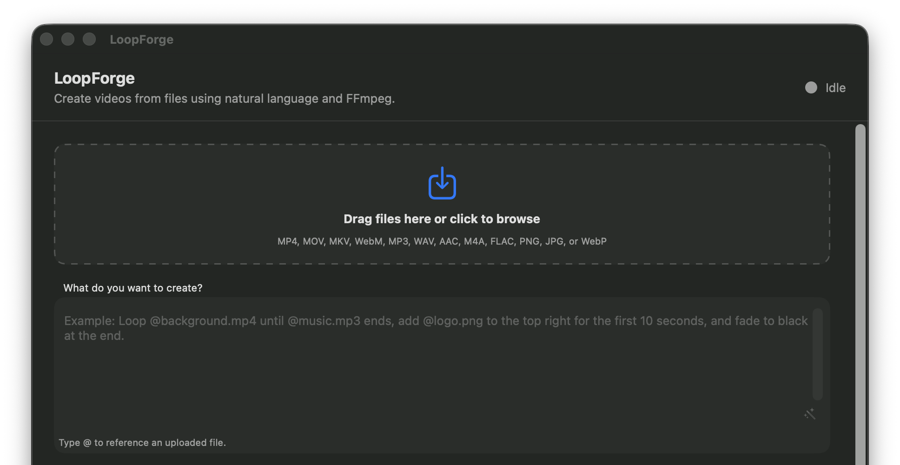

# LoopForge

LoopForge is a native macOS app that turns natural-language video instructions
into validated, deterministic FFmpeg renders.



It supports drag-and-drop or file browsing, `@filename` references, prompt
refinement, OpenAI-compatible providers, OpenRouter, Ollama, clean audio-loop
endings, overlays, export settings, progress, and render logs.

## Download

Download the latest **unsigned early tester build** from the
[GitHub Releases](https://github.com/rijalarogya/LoopForge/releases) page.

Version 1.0.0 supports Apple-silicon Macs running macOS 13 or newer. FFmpeg and
ffprobe are included, so end users do not need Homebrew.

## Install the unsigned build

1. Download the ZIP or DMG from GitHub Releases.
2. Move LoopForge to Applications.
3. In Applications, right-click LoopForge and choose **Open**.
4. If macOS still blocks it, open **System Settings > Privacy & Security**,
   find the LoopForge security message, and click **Open Anyway**.

This early tester build is unsigned, so macOS displays an unidentified
developer warning. Only download LoopForge from this repository's Releases
page and verify the published SHA-256 checksum when possible.

## First run

1. Choose OpenAI-Compatible or OpenRouter and enter your own API key, or run
   Ollama locally.
2. Add video, audio, or image files.
3. Describe the result using `@filename` references.
4. Review the deterministic render plan and start rendering.

LoopForge does not provide a hosted AI service. See [PRIVACY.md](PRIVACY.md).

## Build and test

```sh
swift test
./scripts/build-ffmpeg.sh
./scripts/build-app.sh
open "dist/LoopForge.app"
```

The FFmpeg build is pinned and reproducible. It enables `libx264`, so bundled
media tools are distributed under GPLv3 or later with corresponding source
archives. See [THIRD_PARTY_NOTICES.md](THIRD_PARTY_NOTICES.md).

## Release

Build the free unsigned early tester release:

```sh
./scripts/package-unsigned-release.sh
```

This produces clearly labeled unsigned ZIP and DMG downloads in
`dist/release-1.0.0-unsigned`.

The future Developer ID release path remains available:

```sh
export LOOPFORGE_SIGNING_IDENTITY="Developer ID Application: Your Name (TEAMID)"
./scripts/package-release.sh
```

Store notarization credentials once:

```sh
xcrun notarytool store-credentials LoopForgeNotary
export LOOPFORGE_NOTARY_PROFILE="LoopForgeNotary"
./scripts/notarize.sh
```

Release directories include checksums, third-party notices, and corresponding
FFmpeg/x264 source archives. See
[`docs/RELEASING.md`](docs/RELEASING.md) for the complete checklist.

## Safety model

Provider responses are decoded into an edit intent, validated against imported
assets and supported operations, then translated into an executable path plus
an FFmpeg argument array. LoopForge never executes model-generated shell
commands.

## License

LoopForge source is available under the [MIT License](LICENSE). Bundled FFmpeg
and x264 executables have separate GPL licensing requirements.
